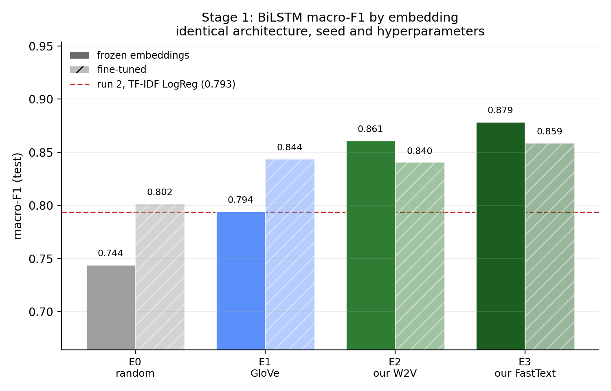

# Stage 1 - ADE sentence classification (report section 7)

Generated by `scripts/document_stage1.py` from `results/runs.csv`, the saved `metrics.json` files and the frozen splits, so every figure here matches the artefacts on disk.

Stage 1 answers one question: **does this sentence report an adverse drug event?** It is the gate for Stage 2 - a sentence it rejects never reaches span extraction - which is why its recall on the positive class matters more than its accuracy, and why Phase 6.2 decomposes the end-to-end loss by which stage caused it.

This section also carries the **third and final evidence type** for the project's headline claim. Sections 6.2 and 6.3 of `report/embedding_documentation.md` showed that domain embeddings have better vocabulary coverage and better nearest neighbours; 7.5 below shows whether that translates into task performance.

---

## 7.1 Task and data

Binary classification over the ADE Corpus v2 classification config, deduplicated by exact sentence text and split once, globally, across both stages (`PLAN.md` F4).

| Split | Sentences | ADE | Positive rate | Mean length |
|---|---|---|---|---|
| train | 14,628 | 2,990 | 20.44% | 127 chars |
| dev | 3,135 | 641 | 20.45% | 126 chars |
| test | 3,133 | 640 | 20.43% | 126 chars |
| **total** | **20,896** | | | |

**The class imbalance is the methodological fact that shapes everything else.** About one sentence in five is positive, so predicting `not-ADE` for every input scores 79.6% accuracy while being useless. Accuracy is reported in the tables below and is deprecated throughout; macro-F1 is the primary metric, and PR-AUC is included because it is threshold-free.

The same split is used by every run, and the test set is scored exactly once per run - all model selection happens on dev.

---

## 7.2 Models compared

Five tiers, chosen so each step isolates one idea rather than changing several things at once (PRD 8.1).

| Run | Tier | Model | Features | Role |
|---|---|---|---|---|
| 1 | T1 | Multinomial Naive Bayes | 1-2gram counts | generative baseline |
| 2 | T2 | Logistic Regression | 1-2gram TF-IDF | discriminative baseline |
| 2b | T2 | Linear SVM | 1-2gram TF-IDF | discriminative baseline |
| 3 | T3 | BiLSTM + attention | E0 random | ablation floor |
| 4 | T3 | BiLSTM + attention | E1 GloVe | general-purpose vectors |
| 5 | T3 | BiLSTM + attention | E2 our Word2Vec | domain vectors |
| 6 | T3 | BiLSTM + attention | E3 our FastText | domain vectors + subword |
| 7 | T4 | bert-base-uncased | WordPiece | general transformer |
| 8 | T5 | BiomedBERT | domain WordPiece | domain transformer |

Runs `3u`-`6u` repeat the T3 ablation with the embedding layer unfrozen; see 7.5.

**Every tier sees the same token stream.** The sparse models use the project tokenizer (`src/tokenizer.py`) rather than scikit-learn's default, so `5-fluorouracil` is not split on the hyphen and `ALL` is not lowercased into a stopword. The tokenizer is a controlled variable, not a per-model detail. The transformers necessarily use their own WordPiece vocabularies - that difference is inherent to the tier and is stated rather than hidden.

---

## 7.3 Training setup

### T3 BiLSTM (runs 3-6, 3u-6u)

| Parameter | Value |
|---|---|
| Hidden units per direction | 256 |
| Layers | 1 |
| Pooling | additive attention |
| Dropout | 0.5 |
| Max sequence length | 96 tokens |
| Optimiser | adam, lr 0.001 |
| Batch size | 32 per device, 32 effective |
| Gradient clipping | 5.0 |
| Class weights | inverse frequency |
| Early stopping | dev macro_f1, patience 3 |
| Seed | 42 |

**Additive attention rather than mean or last-state pooling.** An ADE sentence is usually positive because of a short span inside a longer clinical description, so a pooling function that can concentrate on a few positions matches the label better than one that averages every token.

**Early stopping on dev macro-F1, not dev loss.** Under this imbalance the two disagree: loss keeps improving while the model trades ADE recall for `not-ADE` precision. Selecting on the metric the report leads with is applied identically to all four ablation runs.

### T4/T5 transformers (runs 7-8)

| Parameter | Value |
|---|---|
| Epochs | 3 |
| Learning rate | 2e-05 |
| Batch size | 16 per device, 16 effective |
| Max sequence length | 128 WordPiece tokens |
| Mixed precision | fp16 |
| Optimiser | adamw |
| Checkpoint selection | dev macro_f1 per epoch |
| Seed | 42 |

**Effective batch, not per-device batch.** HF `Trainer` multiplies the per-device batch by the visible device count, so the PRD's "batch 16" means one thing on a single GPU and another on two. The scripts take the effective batch as the argument and derive per-device from the hardware, so the recipe in this table is the recipe that ran (`PLAN.md` F8).

### Where the runs executed

| Property | Value |
|---|---|
| Sparse baselines | local CPU |
| Neural runs | Kaggle, 1x NVIDIA T4 |
| Device counts observed | 0, 1 |
| Kaggle Dataset version | 1 |
| Code commits | `a5e5621`, `c7e280b` |

**All neural runs saw exactly one GPU, and that is load-bearing.** Two visible devices would double the effective batch, and if that differed *between* runs 3-6 the ablation would be comparing batch sizes rather than embeddings. `device_count` is a column in `results/runs.csv` for every run so the claim is checkable rather than asserted.

---

## 7.4 Results

Test-set scores. Selection was on dev throughout; the dev column is shown so the gap between selection and reporting is visible.

| Run | Tier | Model | Embedding | Macro-F1 | ADE P | ADE R | ADE F1 | PR-AUC | Acc. | Dev F1 |
|---|---|---|---|---|---|---|---|---|---|---|
| 1 | T1 | `naive_bayes` | count-1-2gram | 0.7678 | 0.602 | 0.675 | 0.636 | 0.683 | 0.842 | 0.7697 |
| 2 | T2 | `logreg` | tfidf-1-2gram | 0.7934 | 0.671 | 0.672 | 0.671 | 0.743 | 0.866 | 0.7895 |
| 2b | T2 | `linear_svm` | tfidf-1-2gram | 0.7977 | 0.660 | 0.703 | 0.681 | 0.749 | 0.865 | 0.7921 |
| 3 | T3 | `bilstm_attn` | E0_random | 0.7441 | 0.573 | 0.623 | 0.597 | 0.639 | 0.828 | 0.7418 |
| 3u | T3 | `bilstm_attn` | E0_random | 0.8016 | 0.664 | 0.713 | 0.687 | 0.743 | 0.868 | 0.7983 |
| 4 | T3 | `bilstm_attn` | E1 | 0.7942 | 0.581 | 0.856 | 0.692 | 0.786 | 0.845 | 0.7982 |
| 4u | T3 | `bilstm_attn` | E1 | 0.8436 | 0.695 | 0.831 | 0.757 | 0.800 | 0.891 | 0.8474 |
| 5 | T3 | `bilstm_attn` | E2 | 0.8609 | 0.718 | 0.864 | 0.784 | 0.856 | 0.903 | 0.8516 |
| 5u | T3 | `bilstm_attn` | E2 | 0.8404 | 0.735 | 0.759 | 0.747 | 0.817 | 0.895 | 0.8459 |
| 6 | T3 | `bilstm_attn` | E3 | 0.8785 | 0.800 | 0.814 | 0.807 | 0.882 | 0.921 | 0.8845 |
| 6u | T3 | `bilstm_attn` | E3 | 0.8587 | 0.785 | 0.764 | 0.774 | 0.856 | 0.909 | 0.8696 |
| 7 | T4 | `bert-base-uncased` | bert-base-uncased | 0.9159 | 0.855 | 0.878 | 0.867 | 0.926 | 0.945 | 0.9086 |
| 8 | T5 | `biomedbert` | microsoft/BiomedNLP-BiomedBERT-base-uncased-abstract | **0.9402** | 0.876 | 0.938 | 0.906 | 0.944 | 0.960 | 0.9351 |

Best: **run 8** at macro-F1 0.9402. That checkpoint is what Phase 6.1 carries into the end-to-end pipeline (run 12).

---

## 7.5 The embedding ablation - the headline result

The BiLSTM is trained four times. The architecture, hyperparameters, split, seed and device count are held fixed; **the embedding matrix is the only thing that changes**. This is evidence type 3 for the claim in PRD section 7, and the one that adjudicates the coverage and neighbour analyses against each other.

| Run | Embedding | Macro-F1 | vs E0 floor | vs E1 GloVe |
|---|---|---|---|---|
| 3 | E0 random | 0.7441 | - | - |
| 4 | E1 GloVe | 0.7942 | +0.0501 | - |
| 5 | E2 our Word2Vec | 0.8609 | +0.1168 | +0.0667 |
| 6 | E3 our FastText | **0.8785** | +0.1344 | +0.0844 |



**The sharpest way to state the result.** GloVe scores 0.7942. The TF-IDF logistic regression of run 2 scores 0.7934. General-purpose embeddings are worth **+0.0007** macro-F1 over sparse counting on this task - essentially nothing. Our domain embeddings are worth +0.0851 over the same baseline. The value is not in using embeddings; it is in using embeddings trained on the right corpus.

Run 4's error profile is worth noting: precision 0.581 against recall 0.856. GloVe is not merely weaker, it is badly calibrated - it over-predicts the positive class, which for a Stage 1 gate means flooding Stage 2 with entity-free sentences.

### Frozen vs fine-tuned embeddings

The four runs above freeze the embedding layer, which is what makes them a measurement *of the vectors*: nothing about the representation changes during training. Runs `3u`-`6u` repeat the ablation with the layer trainable, which asks a different question - whether the advantage survives task supervision, given that E0's random rows can learn from the training sentences.

| Run | Embedding | Frozen | Fine-tuned | Delta |
|---|---|---|---|---|
| 3 / 3u | E0 random | 0.7441 | 0.8016 | +0.0575 |
| 4 / 4u | E1 GloVe | 0.7942 | 0.8436 | +0.0494 |
| 5 / 5u | E2 our Word2Vec | 0.8609 | 0.8404 | -0.0205 |
| 6 / 6u | E3 our FastText | 0.8785 | 0.8587 | -0.0198 |

**Fine-tuning helped E0 random and E1 GloVe and hurt E2 our Word2Vec and E3 our FastText** - the effect reverses with the quality of the starting vectors. That is what a small training set predicts: 14.6k sentences carry enough signal to improve random or general-purpose rows, but not enough to improve vectors already trained on 160k biomedical abstracts, so updating them mostly discards information.

The ordering this produces is the stronger form of the claim: the best fine-tuned run reaches 0.8587, still below the weakest *frozen* run among E2 our Word2Vec and E3 our FastText at 0.8609. Task supervision does not recover the gap, which says the domain advantage lives in the vectors themselves rather than in the initialisation they provide.

Running both conditions was not decoration. Reporting only the frozen numbers would have invited the objection that the comparison was rigged by denying the weaker embeddings a chance to adapt; reporting only the fine-tuned numbers would have understated the result. PRD section 12 asks for partial and negative results to be explained rather than buried, and this table is where that applies.

---

## 7.6 Domain vs general, replayed at the transformer level

Runs 7 and 8 ask the same question as the ablation, one level up: identical architecture, identical recipe, identical split, **different pretraining corpus**.

| Run | Model | Pretraining corpus | Macro-F1 | ADE F1 |
|---|---|---|---|---|
| 7 | `bert-base-uncased` | books + Wikipedia | 0.9159 | 0.867 |
| 8 | BiomedBERT | PubMed abstracts | 0.9402 | 0.906 |

**The sign agrees in both places.** Domain pretraining is worth +0.0844 macro-F1 at the static-embedding level (E3 over E1) and +0.0243 at the contextual level (BiomedBERT over BERT-base). The same argument holds twice, at two levels of the stack, on the same split. That symmetry is what PRD 8.1 was after, and it is a stronger claim than either result alone.

The margin is smaller at the transformer level, and that should be stated plainly rather than glossed: both transformers are strong enough that the pretraining corpus matters less than it does when static vectors are all the model has to work with.

---

## 7.7 What each tier actually fixed

Computed from the saved test predictions, which are aligned row-for-row with the frozen test split. A column of F1 scores says one model is better; this says *which sentences* changed hands, which is the part the Phase 6.4 error taxonomy builds on.

| Step up | Fixed (wrong -> right) | Broke (right -> wrong) | Net |
|---|---|---|---|
| run 3 -> run 4 | 357 | 306 | +51 |
| run 4 -> run 5 | 291 | 108 | +183 |
| run 5 -> run 6 | 138 | 83 | +55 |
| run 6 -> run 7 | 149 | 73 | +76 |
| run 7 -> run 8 | 88 | 40 | +48 |

**30 of 3,133 test sentences are misclassified by every model in the ladder** (1.0%), and 2,169 (69.2%) are classified correctly by all of them. The models therefore disagree about roughly 29.8% of the test set - that band is where the entire spread of the results table lives.

Of the 30 sentences nobody gets right, 12 are true ADEs that every model missed. A sample:

- Adrenaline dacryolith: detection by ultrasound examination of the nasolacrimal duct.
- An unusual cause of burn injury: unsupervised use of drugs that contain psoralens.
- DISCUSSION: No published clinical studies in patients receiving clindamycin vaginal cream for bacterial vaginosis have documented C. difficile toxin in stool samples of patients with diarrhea.
- Extra caution should be taken in using octreotide or its long-acting analog in patients otherwise predisposed to intrahepatic bile stasis.

Rather than characterise those four examples by eye - they change whenever the runs are redone - the whole set is measured against a fixed cue list (`src/challenge_set.py`) that was not adjusted after this result came in:

| Cue type | Rate in the test split | Rate among universally-missed | Enrichment |
|---|---|---|---|
| negation | 8.7% | 10.0% | 1.15x |
| hedging | 12.2% | 13.3% | 1.09x |

Neither cue type is meaningfully enriched among the universally-missed sentences, so on this evidence the residual errors are **not** explained by negation or hedging. That is worth stating because the opposite is easy to believe: the handful of examples printed above visibly contain both a hedge and a negation, and reading four sentences would have produced the wrong conclusion. Phase 6.4 should categorise these by hand rather than assume the PRD's taxonomy accounts for them.

**Read the enrichment column with its sample size in mind.** It is computed over 30 sentences, so one sentence moves the rate by roughly 3.3 percentage points and nothing here is a significance test. The number that is solid is the denominator - the corpus-wide cue rates - and the fact that the universally-missed set is not *obviously* dominated by either cue.

The proper version of this analysis is Phase 6.3, which evaluates every Stage 1 tier on a frozen, rule-selected negation subset large enough to compare against full-test performance. This table only says where to look.

These sentences are the starting point for the Phase 6.4 error taxonomy, whose categories are negation, hedging, multi-drug sentences, abbreviations and boundary cases.

## Compute cost

| Tier | Runs | Hardware | Total training time |
|---|---|---|---|
| Sparse (1, 2, 2b) | 3 | CPU, local | 5.1 s |
| Neural (3-8, 3u-6u) | 10 | 1x T4, Kaggle | 15.1 min |

The comparison worth putting in the report: run 2 (TF-IDF logistic regression) reaches macro-F1 0.7934 in 3.5 seconds on a laptop CPU, and run 8 reaches 0.9402 in 3.7 minutes on a T4. The transformer is worth +0.1467 macro-F1 for roughly 63x the compute. Both halves of that sentence belong in the write-up.

## Reproduction

```bash
python scripts/train_baselines.py                              # runs 1, 2, 2b (local, seconds)
python scripts/train_bilstm.py --run-id 3 --embedding E0_random  # runs 3-6
python scripts/train_bilstm.py --run-id 4 --embedding E1
python scripts/train_bilstm.py --run-id 5 --embedding E2
python scripts/train_bilstm.py --run-id 6 --embedding E3
python scripts/train_bert.py   --run-id 7 --model bert-base-uncased
python scripts/train_bert.py   --run-id 8 --model biomedbert
python scripts/stage1_report.py                                # table + chart
python scripts/document_stage1.py                              # this document
```

Add `--unfreeze-embeddings` to the four BiLSTM commands for runs 3u-6u. The neural runs execute from `notebooks/stage1_remote.ipynb`, which clones the repository and calls exactly these scripts - it contains no training logic of its own, which is what makes "runs 3-6 differ only in the embedding matrix" a checkable statement about a command line.

## Threats to validity

| Threat | Status |
|---|---|
| Ablation confounded by batch size across GPUs | controlled - single GPU pinned, `device_count` logged per run |
| Uncovered embedding rows adding noise to the ablation | controlled - one shared seeded random base across E0-E3 |
| Test set used for model selection | controlled - selection on dev, test scored once per run |
| Sparse baselines undertuned, flattering the neural tiers | controlled - each got a grid, `class_weight` included, selected on dev |
| Neural tiers given more data than the baselines | controlled - all fit on train only, none refit on train+dev |
| Accuracy read as the headline under 1:4 imbalance | flagged in 7.1 and in every table |
| Frozen-only ablation flattering the domain vectors | controlled - both conditions run and reported in 7.5 |
| Single-seed results | **not controlled** - every run is seed 42 only; the margins in 7.5 are large but no variance estimate exists |
