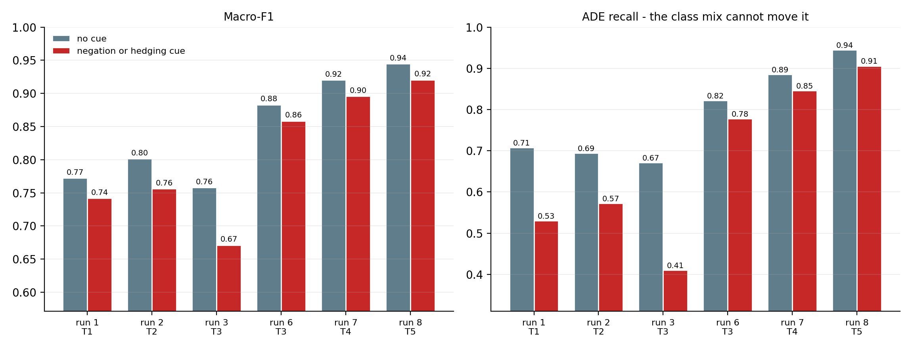

# Negation and hedging (step 6.3, run 13)

Generated by `scripts/negation_eval.py` from the saved Stage 1 test predictions and the frozen challenge subset. Nothing is trained; every run's predictions reproduce its logged test macro-F1 before they are scored here.

## The subset

Selected by rule from the Stage 1 test split (`src/challenge_set.py`), from sentence text alone, and frozen to `data/splits/stage1_test_cues.parquet` (PLAN F6). It is selection, not annotation - every label is the corpus's own.

| Group | Sentences | ADE | ADE rate |
|---|---|---|---|
| full test split | 3,133 | 640 | 20.4% |
| contains a negation cue | 272 | 25 | 9.2% |
| contains a hedging cue | 382 | 94 | 24.6% |
| **either - the challenge subset** | 615 | 117 | 19.0% |
| neither | 2,518 | 523 | 20.8% |

39 sentences contain both kinds of cue. PRD 8.3 suggested hand-picking 50-80 sentences; the rule selects 615, which turns the comparison below into a measurement with intervals rather than an anecdote.

The class mix is similar in both groups (19.0% ADE with a cue, 20.8% without), so a macro-F1 difference between them is not a prevalence artefact.

That does not hold for the two cue types separately: 9.2% of negation-cue sentences are ADE and 24.6% of hedging-cue sentences are ADE, against 20.8% with no cue. The Negation and Hedging macro-F1 columns below therefore mix a scope effect with a class-mix effect and should not be read on their own; the combined contrast and the per-class recalls are the evidence.

| Negation cue | Sentences |
|---|---|
| `not` | 120 |
| `no` | 67 |
| `without` | 66 |
| `failed to` | 7 |
| `none` | 6 |
| `ruled out` | 4 |
| `unremarkable` | 2 |
| `denied` | 1 |

| Hedging cue | Sentences |
|---|---|
| `may` | 137 |
| `suggest` | 85 |
| `potential` | 59 |
| `possibl` | 51 |
| `could` | 25 |
| `might` | 15 |
| `appears` | 14 |
| `likely` | 12 |

**When the cue lists were fixed.** They were written during the Phase 4 documentation, after the Stage 1 test predictions existed and after four sentences every Stage 1 model misclassifies had been read; report section 7.7 then used them to show those universally-missed sentences are not enriched for either cue. They have not been changed since, and `tests/test_challenge_set.py` pins them. The selection reads text only - no prediction or label chose a sentence.

## Macro-F1 with and without cues

Positive differences mean a run does *better* on cue sentences. Brackets are 95% bootstrap intervals for the difference, each group resampled independently (2,000 resamples). Runs PRD section 9 lists for run 13 are in bold.

| Run | Tier | Model | Full | Negation | Hedging | No cue | Cue - no cue |
|---|---|---|---|---|---|---|---|
| **1** | T1 | `naive_bayes` | 0.7678 | 0.6801 | 0.7476 | 0.7724 | -0.0307 [-0.0807, +0.0182] |
| **2** | T2 | `logreg` | 0.7934 | 0.6696 | 0.7656 | 0.8014 | -0.0451 [-0.0957, +0.0014] |
| 2b | T2 | `linear_svm` | 0.7977 | 0.6646 | 0.7764 | 0.8054 | -0.0442 [-0.0927, +0.0006] |
| 3 | T3 | `bilstm_attn` | 0.7441 | 0.6524 | 0.6590 | 0.7579 | -0.0869 [-0.1395, -0.0374] |
| 4 | T3 | `bilstm_attn` | 0.7942 | 0.7156 | 0.7726 | 0.8003 | -0.0328 [-0.0796, +0.0096] |
| 5 | T3 | `bilstm_attn` | 0.8609 | 0.7991 | 0.8318 | 0.8691 | -0.0437 [-0.0855, -0.0044] |
| **6** | T3 | `bilstm_attn` | 0.8785 | 0.7875 | 0.8819 | 0.8831 | -0.0247 [-0.0640, +0.0130] |
| 3u | T3 | `bilstm_attn` | 0.8016 | 0.7023 | 0.7796 | 0.8081 | -0.0390 [-0.0887, +0.0056] |
| 4u | T3 | `bilstm_attn` | 0.8436 | 0.8070 | 0.8233 | 0.8470 | -0.0187 [-0.0599, +0.0230] |
| 5u | T3 | `bilstm_attn` | 0.8404 | 0.7805 | 0.8353 | 0.8431 | -0.0152 [-0.0600, +0.0272] |
| 6u | T3 | `bilstm_attn` | 0.8587 | 0.7661 | 0.8258 | 0.8667 | -0.0447 [-0.0883, -0.0014] |
| **7** | T4 | `bert-base-uncased` | 0.9159 | 0.8607 | 0.9076 | 0.9205 | -0.0247 [-0.0603, +0.0086] |
| **8** | T5 | `biomedbert` | 0.9402 | 0.8888 | 0.9272 | 0.9447 | -0.0242 [-0.0546, +0.0044] |

PRD 8.3 asks for accuracy. It is logged for every group in the run 13 rows of `results/runs.csv` but not tabulated: with four sentences in five not-ADE, accuracy rewards exactly the failure this section looks for - a model that stops predicting ADE when it sees a cue.

## Per-class recall, which the class mix cannot move

| Run | Tier | ADE recall: cue / no cue | Difference | not-ADE recall: cue / no cue | Difference |
|---|---|---|---|---|---|
| **1** | T1 | 0.530 / 0.707 | -0.178 [-0.274, -0.081] | 0.926 / 0.875 | +0.051 [+0.022, +0.076] |
| **2** | T2 | 0.573 / 0.694 | -0.121 [-0.218, -0.024] | 0.922 / 0.914 | +0.008 [-0.021, +0.034] |
| 2b | T2 | 0.598 / 0.727 | -0.128 [-0.226, -0.031] | 0.916 / 0.905 | +0.011 [-0.019, +0.038] |
| 3 | T3 | 0.410 / 0.671 | -0.261 [-0.356, -0.164] | 0.908 / 0.874 | +0.033 [+0.002, +0.063] |
| 4 | T3 | 0.812 / 0.866 | -0.054 [-0.128, +0.019] | 0.835 / 0.843 | -0.008 [-0.045, +0.029] |
| 5 | T3 | 0.812 / 0.876 | -0.064 [-0.140, +0.009] | 0.900 / 0.916 | -0.017 [-0.047, +0.012] |
| **6** | T3 | 0.778 / 0.822 | -0.044 [-0.127, +0.033] | 0.944 / 0.949 | -0.005 [-0.028, +0.017] |
| 3u | T3 | 0.590 / 0.740 | -0.150 [-0.249, -0.048] | 0.928 / 0.902 | +0.025 [-0.002, +0.052] |
| 4u | T3 | 0.803 / 0.837 | -0.034 [-0.112, +0.047] | 0.906 / 0.907 | -0.001 [-0.030, +0.027] |
| 5u | T3 | 0.718 / 0.769 | -0.051 [-0.145, +0.040] | 0.936 / 0.928 | +0.007 [-0.018, +0.032] |
| 6u | T3 | 0.675 / 0.784 | -0.109 [-0.202, -0.016] | 0.946 / 0.946 | -0.001 [-0.022, +0.021] |
| **7** | T4 | 0.846 / 0.885 | -0.039 [-0.112, +0.033] | 0.956 / 0.963 | -0.008 [-0.028, +0.012] |
| **8** | T5 | 0.906 / 0.945 | -0.039 [-0.096, +0.018] | 0.960 / 0.967 | -0.008 [-0.027, +0.010] |

**6 of 13 runs lose ADE recall on cue sentences with an interval entirely below zero** (runs 1, 2, 2b, 3, 3u, 6u), against 3 whose macro-F1 difference excludes zero (runs 3, 5, 6u).

**Macro-F1 understates the effect because the two classes can move in opposite directions.** In runs 1 and 3, ADE recall falls on cue sentences while not-ADE recall *rises*, both intervals clear of zero: a cue word pushes the model toward not-ADE, and macro-F1 averages a loss on one class with a gain on the other.

## PRD 8.3's hypothesis, tested

PRD 8.3 expects the bag-of-words models to collapse on these sentences, the BiLSTM to partially recover, and BERT to handle them best. Each claim is checked below with **ADE recall** as the primary evidence: it is the class a scope error hides - a negated or hedged ADE report read as no ADE - and the class mix cannot move it.

1. **Do the bag-of-words models collapse?** On cue sentences ADE recall changes by -0.178 [-0.274, -0.081] for run 1; -0.121 [-0.218, -0.024] for run 2 - against -0.044 [-0.127, +0.033] for run 6; -0.039 [-0.112, +0.033] for run 7; -0.039 [-0.096, +0.018] for run 8. **The direction the PRD predicts holds, and it is significant**: the sparse models miss clearly more ADE sentences once a cue is present, while the neural tiers' losses average 27% of the sparse models' and cannot be told apart from zero. 'Collapse' still overstates it: the sparse models keep an ADE recall of at least 0.53 on cue sentences. On macro-F1 the same comparison is muted (-0.0307 for run 1; -0.0451 for run 2; -0.0247 for run 6; -0.0247 for run 7; -0.0242 for run 8), for the reason given above.

2. **Does the BiLSTM partially recover?** That depends on its embeddings, not on its being a BiLSTM. With random embeddings (run 3 - not in PRD section 9's list, but the same architecture) ADE recall on cue sentences changes by -0.261 [-0.356, -0.164]; with our frozen FastText vectors (run 6) by -0.044 [-0.127, +0.033]. The recovery is real, and it belongs to the pretrained representation rather than to the recurrent architecture - run 3 loses more ADE recall than any of the 13 runs, sparse models included. Every frozen BiLSTM with pretrained vectors - GloVe (run 4) included - avoids a significant loss, so on this question it is pretraining as such, not domain pretraining, that matters; section 7.5's domain advantage shows up in the level of each score, not in its robustness to cues.

3. **Does BERT handle them best?** On level, yes: run 8 has both the highest ADE recall (0.906) and the highest macro-F1 (0.9205) on cue sentences. On robustness the evidence is weaker: the neural tiers' ADE-recall changes (-0.044 for run 6; -0.039 for run 7; -0.039 for run 8) all have intervals spanning zero, so none is shown to be affected by cues, and none is shown to be less affected than another.

4. **Do the cues reorder the tiers?** No - the macro-F1 ranking is the same with and without cues: run 8 > run 7 > run 6 > run 2 > run 1.

## Threats to validity

| Threat | Status |
|---|---|
| Subset chosen after seeing which sentences models fail | controlled - selected by a text-only rule and frozen; the cue lists' history is stated above in full |
| A cue word is not a cue in scope | not controlled - surface patterns; the subset is enriched for scope phenomena, not made of them |
| Class mix moving macro-F1 | controlled - per-class recalls reported beside it, and ADE recall used as the primary evidence |
| Negation-only and hedging-only columns | flagged - their class mixes differ from the no-cue group's; the combined contrast is the one to read |
| Subset too small to separate tiers | measured - difference intervals are 0.059-0.102 macro-F1 wide |
| Full-test comparison diluted by overlap | controlled - cue sentences compared with the disjoint no-cue group |
| Single seed | **not controlled** - one model per tier, seed 42 |
