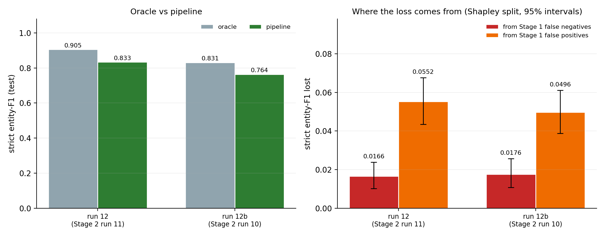

# End-to-end pipeline (steps 6.1-6.2, runs 12 and 12b)

Generated by `scripts/pipeline_eval.py`. Nothing is trained: Stage 1 decisions are the saved test predictions of the gate run, and Stage 2 is decoded on CPU over every Stage 1 test sentence through the path `scripts/check_stage2_inference.py` verifies against the remote decode.

Stage 2's own report scores it in the **oracle** setting - on the gold-positive sentences, as if Stage 1 were perfect. The **pipeline** setting lets Stage 1 decide: sentences it rejects get no entities, and sentences it wrongly accepts are tagged like any other. Both are scored over the same 3,133-sentence test split, containing all 1,612 gold entities, which is valid only because Stage 1 and Stage 2 share one global split (PLAN F4).

## The gate

Stage 1 run 8 (`biomedbert`, test macro-F1 0.9402):

| | Gate says ADE | Gate says not-ADE |
|---|---|---|
| ADE sentence | 600 | 40 |
| not-ADE sentence | 85 | 2,408 |

It passes 685 sentences to Stage 2: 600 of the 640 ADE sentences (93.8% recall) and 85 that are not (87.6% precision).

## Oracle vs pipeline

| Run | Stage 2 | Setting | Strict F1 | Precision | Recall | Lenient F1 | Overlap F1 | Predicted entities |
|---|---|---|---|---|---|---|---|---|
| 12 | run 11 | oracle | 0.9052 | 0.898 | 0.913 | 0.8982 | 0.9526 | 1,638 |
| 12 | run 11 | **pipeline** | 0.8334 | 0.801 | 0.869 | 0.8278 | 0.8743 | 1,750 |
| 12b | run 10 | oracle | 0.8308 | 0.854 | 0.809 | 0.8314 | 0.9185 | 1,527 |
| 12b | run 10 | **pipeline** | 0.7636 | 0.757 | 0.770 | 0.7640 | 0.8441 | 1,641 |

Each oracle row reproduces its Stage 2 run's logged test F1 exactly (run 11 0.9052, run 10 0.8308), so the pipeline rows are measured with the same scorer, over the same entities, as `report/stage2_documentation.md`.

**Chaining the stages costs run 12 0.0718 strict entity-F1** (0.9052 oracle to 0.8334 pipeline). Recall falls from 0.913 to 0.869 and precision from 0.898 to 0.801.

## Where the loss comes from (PRD 8.4)

The loss has two sources, and they interact. Stage 1 false negatives take gold entities out of reach; Stage 1 false positives add predictions with no gold behind them. Both act on F1's shared denominator, so whichever is removed first changes how much the other appears to cost. Both orders are computed below, and the loss is divided by their average - the two-player Shapley value, which sums exactly to the total. Brackets are 95% sentence-level bootstrap intervals (2,000 resamples).

| Run | Total loss | From Stage 1 false negatives | From Stage 1 false positives | FN removed first (FN / FP) | FP added first (FN / FP) |
|---|---|---|---|---|---|
| 12 | 0.0718 [0.0580, 0.0869] | 0.0166 (23%) [0.0102, 0.0238] | 0.0552 (77%) [0.0434, 0.0676] | 0.0163 / 0.0555 | 0.0169 / 0.0549 |
| 12b | 0.0672 [0.0544, 0.0810] | 0.0176 (26%) [0.0108, 0.0257] | 0.0496 (74%) [0.0388, 0.0611] | 0.0175 / 0.0498 | 0.0177 / 0.0495 |

**40 ADE sentences never reached Stage 2.** They hold 90 of the 1,612 gold entities, and Stage 2 finds 70 of those exactly when it is given the sentences - so the gate's misses cost 70 true positives outright.

**85 non-ADE sentences did reach it.** Stage 2 extracted 210 entities from every one of them (100 DRUG, 110 EFFECT; 2.5 per sentence), and all of them count as false positives. Not all of them are tagging mistakes: ADE Corpus v2 annotates drugs and effects only inside adverse-event relations, so a drug correctly named in a sentence that reports no adverse event is still not an entity of this task. The sentences a gate wrongly passes are, almost by definition, the ones that read like ADE reports - which is why every one of them hands Stage 2 something to extract.

**The gate's false positives dominate the loss**, and the bootstrap intervals for the two shares do not overlap. That points at the gate's precision, not its recall, as the lever for the pipeline - the opposite of the usual instinct to tune a screening stage for recall. It is not tested here: moving the threshold would need Stage 1 dev scores, which were not saved, and choosing it on test would contaminate every number above.

Run 12b puts the BiLSTM-CRF behind the same gate - the configuration PLAN 7.2 ships in the demo. It loses 0.0672 (0.8308 to 0.7636). The gate is identical, so the 40 missed and 85 extra sentences are the same; the loss differs only through what each tagger does with them.

## Does a better gate matter?

Every Stage 1 run with saved test predictions, used as the gate in front of Stage 2 run 11. Stage 2 is held fixed, so the rows differ only in which sentences reach it.

| Gate | Model | Gate macro-F1 | ADE recall | ADE precision | Pipeline strict F1 | Loss | from FN | from FP |
|---|---|---|---|---|---|---|---|---|
| run 8 | `biomedbert` | 0.9402 | 0.938 | 0.876 | **0.8334** | 0.0718 | 0.0166 | 0.0552 |
| run 7 | `bert-base-uncased` | 0.9159 | 0.878 | 0.855 | **0.7965** | 0.1088 | 0.0499 | 0.0588 |
| run 6 | `bilstm_attn` | 0.8785 | 0.814 | 0.800 | **0.7530** | 0.1522 | 0.0785 | 0.0737 |
| run 5 | `bilstm_attn` | 0.8609 | 0.864 | 0.718 | **0.7332** | 0.1720 | 0.0580 | 0.1140 |
| run 6u | `bilstm_attn` | 0.8587 | 0.764 | 0.785 | **0.7331** | 0.1721 | 0.1039 | 0.0682 |
| run 4u | `bilstm_attn` | 0.8436 | 0.831 | 0.695 | **0.7229** | 0.1823 | 0.0678 | 0.1145 |
| run 5u | `bilstm_attn` | 0.8404 | 0.759 | 0.735 | **0.7143** | 0.1909 | 0.1013 | 0.0896 |
| run 4 | `bilstm_attn` | 0.7942 | 0.856 | 0.581 | **0.6766** | 0.2286 | 0.0539 | 0.1747 |
| run 3u | `bilstm_attn` | 0.8016 | 0.713 | 0.664 | **0.6640** | 0.2412 | 0.1292 | 0.1120 |
| run 2b | `linear_svm` | 0.7977 | 0.703 | 0.660 | **0.6583** | 0.2470 | 0.1346 | 0.1124 |
| run 2 | `logreg` | 0.7934 | 0.672 | 0.671 | **0.6506** | 0.2546 | 0.1518 | 0.1028 |
| run 1 | `naive_bayes` | 0.7678 | 0.675 | 0.602 | **0.6282** | 0.2770 | 0.1523 | 0.1247 |
| run 3 | `bilstm_attn` | 0.7441 | 0.623 | 0.573 | **0.5850** | 0.3202 | 0.2013 | 0.1189 |

The gate with the best macro-F1 is also the best gate for the pipeline (run 8). Across these 13 gates, pipeline F1 correlates with gate macro-F1 at r = 0.99, with ADE recall at r = 0.89 and with ADE precision at r = 0.93; tracking precision more closely than recall is consistent with false positives being the larger loss. With 13 points these are descriptive, not a test.

## Threats to validity

| Threat | Status |
|---|---|
| Stage 1 threshold not tuned for the pipeline | **not controlled** - the gate is the saved argmax decision; Stage 1 dev scores were not saved, so no threshold can be chosen without touching test |
| Stage 2 decoded locally, not remotely | controlled - the CPU decode is checked against the saved remote decode on every gold-positive sentence before scoring, and each oracle row reproduces the logged F1 |
| Long sentences truncated by the tagger | measured - run 11: 0 of 3,133 sentences over 192 subwords, run 10: 1 of 3,133 sentences over 96 tokens; words past the limit are tagged `O` |
| Drugs named in non-ADE sentences scored as false positives | by task definition - stated above |
| Single seed | **not controlled** - every model in the chain is seed 42 only |
