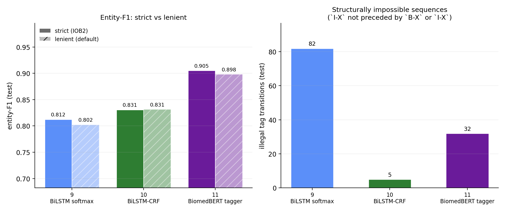

# Stage 2 results (steps 5.7-5.9, runs 9-11)

Generated by `scripts/stage2_report.py`. Entity-level scoring is redone **locally, from the saved tag sequences** - the remote session is trusted for the training, not for the numbers.

All three runs share the frozen split, the project tokenizer, the BIO converter and seed 42, and are scored over an identical word-level token stream. Run 11 predicts at subword level and is read back to words (the first piece of each word) before scoring, or its entity counts would not be comparable with the BiLSTMs'.

## Entity-F1 (test)

| Run | Model | Strict F1 | Lenient F1 | Lenient - strict | Overlap F1 | Strict P | Strict R | Illegal transitions |
|---|---|---|---|---|---|---|---|---|
| 9 | BiLSTM softmax | **0.8124** | 0.8024 | -0.0099 | 0.9138 | 0.818 | 0.807 | 82 |
| 10 | BiLSTM-CRF | **0.8308** | 0.8314 | +0.0006 | 0.9185 | 0.854 | 0.809 | 5 |
| 11 | BiomedBERT tagger | **0.9052** | 0.8982 | -0.0070 | 0.9526 | 0.898 | 0.913 | 32 |

Three scores, three different questions. **Strict** is exact-match IOB2 entity-F1, the headline. **Lenient** is seqeval's default: boundaries must still be exact, but a malformed sequence such as `O I-DRUG` is repaired into an entity first. **Overlap** credits a predicted entity that overlaps a gold entity of the same label even when its boundaries are wrong - the PRD's partial-match stretch goal. Lenient is easily mistaken for a partial-match score, and `PLAN.md` step 5.7 makes that mistake; only the overlap column measures tolerance to boundary errors.

## What lenient scoring adds (step 5.7)

**Strict** requires a well-formed IOB2 entity: `O I-DRUG` scores nothing. **Lenient**, seqeval's default, reads the same sequence as a DRUG entity. Both readings open an entity at every `B-X`, so a model's strict entities are always a subset of its lenient ones, and the two scores differ only by the *repaired* entities - exactly one per illegal transition.

With k repairs of which c are correct, lenient F1 beats strict F1 exactly when c / k > strict F1 / 2 (`repaired_entities` in `src/stage2_metrics.py`; the test suite checks the criterion in exact arithmetic). The sign of the gap is therefore not a property of the scoring mode. It measures how often a model's malformed output was right anyway.

| Run | Model | Repairs (k) | Correct (c) | c / k | Needed to help | Lenient vs strict |
|---|---|---|---|---|---|---|
| 9 | BiLSTM softmax | 82 | 17 | 20.7% | > 40.6% | lower (-0.0099) |
| 10 | BiLSTM-CRF | 5 | 3 | 60.0% | > 41.5% | higher (+0.0006) |
| 11 | BiomedBERT tagger | 32 | 3 | 9.4% | > 45.3% | lower (-0.0070) |

**Lenient scoring penalises the softmax tagger rather than flattering it.** Run 9 emitted 82 malformed entities and 17 of them (21%) were right - far short of the 41% a repair needs in order to help - so the lenient reading costs it -0.0099. The intuitive expectation is the reverse: that a scorer which forgives malformed output favours the model producing the most of it. Reporting both columns is what shows which of the two holds here.

Run 11 behaves the same way: 3 of 32 repairs correct (9%), so lenient scoring lowers it by 0.0070.

For run 10 the question barely arises: 5 repairs in total, and the two modes agree to within 0.0006.

## The CRF ablation (runs 9 vs 10, step 5.8)

Identical embedding, architecture, hyperparameters and seed. **`--crf` is the only flag that differs**, so everything below is attributable to structured prediction.

| | Run 9 softmax | Run 10 CRF | Difference |
|---|---|---|---|
| Entity-F1 strict | 0.8124 | 0.8308 | +0.0185 |
| Precision strict | 0.818 | 0.854 | +0.036 |
| Recall strict | 0.807 | 0.809 | +0.002 |
| Entity-F1 lenient | 0.8024 | 0.8314 | +0.0290 |
| Illegal transitions | 82 | 5 | -77 |
| Sentences affected | 72 | 5 | -67 |
| Training time | 19 s | 94 s | x4.9 |
| Selected epoch / epochs run | 13 / 17 | 15 / 19 | |

**The CRF cut illegal transitions by 94%** - 82 to 5 - without eliminating them.

The mechanism is worth stating precisely, because it is easy to overclaim. `pytorch-crf` forbids nothing: its transition matrix is initialised uniformly and every transition stays reachable. The gold sequences contain no illegal transition at all, so training drives those transition scores down until Viterbi rarely chooses a path through them. The constraint is **learned from the data, not imposed by the architecture**. A per-token softmax has no way to learn it: it scores each position independently, so no transition ever appears in its objective.

The 5 that remain are what "learned, not imposed" predicts: a path through a heavily penalised transition is still chosen when the emission scores favour it strongly enough. Report the reduction as what it is - a large decrease, not a guarantee.

**The training logs show the constraint being learned.** On dev, run 10 emitted 96 illegal transitions after its first epoch, 4 at the epoch selected (15), and as few as 0 over 19 epochs. Run 9 started at 233, was at 69 at its selected epoch (13), and never went below 69. The softmax tagger does emit fewer malformed sequences as its per-token predictions improve, but it plateaus; the CRF keeps pushing the count toward zero because transitions are part of what it optimises.

Entity-F1 moved +0.0185 as well, so here the CRF pays on the metric axis too - at 4.9x the training time.

### What the CRF changed about the entities it emits

Every predicted entity classified against gold under the strict reading (`error_breakdown`): exact; overlapping a gold entity of the same label with the wrong boundaries; overlapping only one of the other label; or overlapping nothing.

| Predicted entities | Run 9 | Run 10 | Difference |
|---|---|---|---|
| exact | 1,301 | 1,304 | +3 |
| boundary error | 171 | 135 | -36 |
| wrong type | 25 | 20 | -5 |
| spurious | 94 | 68 | -26 |
| **total** | **1,591** | **1,527** | **-64** |

**The CRF does not find more entities; it stops emitting broken ones.** Exact matches moved by +3. Wrong predictions fell by 67: 36 fewer boundary errors, 5 fewer wrong-type entities, 26 fewer spurious entities. That is why the gain is almost entirely precision (0.818 to 0.854) while recall barely moves (0.807 to 0.809): structured decoding is acting as a filter on malformed and fragmentary output, not as a source of new detections.

### Which transitions are illegal

| Transition | Run 9 | Run 10 | Run 11 |
|---|---|---|---|
| `O -> I-EFFECT` | 73 | 4 | 28 |
| `B-DRUG -> I-EFFECT` | 8 | 0 | 1 |
| `O -> I-DRUG` | 1 | 0 | 3 |
| `I-DRUG -> I-EFFECT` | 0 | 1 | 0 |

**88% of all illegal transitions across the three taggers are an `I-EFFECT` straight after `O`** - a model continuing an EFFECT it never opened. That is where the structure lives: 65% of gold EFFECT entities span more than one token, against 10% of DRUG entities, so EFFECT is the label on which B-versus-I decisions are made at all.

## Per-entity breakdown

DRUG and EFFECT are not equally hard, and the report should say which is which rather than average them away.

**Run 9 - BiLSTM softmax**

| Entity | Precision | Recall | F1 (strict) | Support |
|---|---|---|---|---|
| DRUG | 0.914 | 0.894 | 0.904 | 762 |
| EFFECT | 0.733 | 0.729 | 0.731 | 850 |

**Run 10 - BiLSTM-CRF**

| Entity | Precision | Recall | F1 (strict) | Support |
|---|---|---|---|---|
| DRUG | 0.912 | 0.896 | 0.904 | 762 |
| EFFECT | 0.798 | 0.731 | 0.763 | 850 |

**Run 11 - BiomedBERT tagger**

| Entity | Precision | Recall | F1 (strict) | Support |
|---|---|---|---|---|
| DRUG | 0.962 | 0.965 | 0.963 | 762 |
| EFFECT | 0.842 | 0.866 | 0.854 | 850 |

**EFFECT is the harder label for every tagger** - F1 0.731 / 0.763 / 0.854 against 0.904 / 0.904 / 0.963 for DRUG (runs 9, 10, 11).

Between runs 9 and 10, DRUG F1 moved +0.0003 and EFFECT F1 +0.0318 - **the CRF's gain is an EFFECT gain**, which is what the transition table above predicts.

## Sanity check against external figures (step 5.9)

An entity-F1 can look entirely reasonable while measuring nothing - the failure PLAN F5 describes, where the converter produces empty labels and training proceeds happily on them. Two external checks guard against it: the BIO conversion against the corpus statistics published for this benchmark (PRD 6.1 fact 4), and our scores against a published tagger trained on the same corpus.

### The conversion against the published statistics

| Quantity | This project | Published | Difference |
|---|---|---|---|
| Sentences with ADE relations | 4,271 | 4,272 | -0.02% |
| Tokens | 86,080 | 86,865 | -0.90% |
| EFFECT tokens (published as "ADE tags") | 12,201 | 12,264 | -0.51% |
| DRUG tokens (published as "Drug tags") | 5,637 | 5,544 | +1.68% |

**Every count lands within 1.7% of the published figure.** Agreement on four counts at once, computed from the committed splits through the converter the training scripts use, is not something a broken offset alignment produces by accident - a systematic alignment error moves entity token counts wholesale, not by a percent or two.

**Why the residuals are not zero.** The published counts are token-level under the benchmark's own tokenizer. The domain tokenizer from step 2.1 keeps `5-fluorouracil`, `TNF-alpha` and `20 mg/kg` whole where a naive tokenizer splits them, so fewer tokens overall (86,080 against 86,865) is the expected direction - the property `results/figures/tokenizer_table.md` measures directly. The two label counts miss in opposite directions (EFFECT -0.51%, DRUG +1.68%) and are not decomposed further here: the published figures do not document their tokenizer or their treatment of nested spans, so any mechanism offered for a residual this size would be a guess.

| Conversion diagnostic | Count |
|---|---|
| Annotated spans | 11,014 |
| Entities tagged | 10,857 |
| Spans needing boundary snapping | 744 |
| Spans matching no token | **0** |
| Spans dropped as nested/overlapping | 157 |

**0 unmatched spans** is the number PLAN F5 is about. The PRD's reference implementation would have returned all-`O` for any span it could not align and said nothing; here the count is asserted and reported, so "zero" is a measurement rather than an assumption.

### Against a published tagger

`jsylee/scibert_scivocab_uncased-finetuned-ner` (Hub revision `609e6d9db901`) is SciBERT fine-tuned for DRUG/EFFECT tagging on ADE Corpus v2 - the reference PRD 6.1 names. `scripts/reference_tagger.py` runs it over exactly the word stream runs 9-11 were scored on, with the same strict scorer.

| Model | Trained on | Our train | Our dev | Our test |
|---|---|---|---|---|
| Reference SciBERT | ADE Corpus v2, split undocumented | 0.8473 | 0.8672 | **0.8599** |
| Run 11 BiomedBERT (ours) | our train split only | 0.9924 *(seen)* | 0.9029 | **0.9052** |

**Our gold tags and scorer are not silently broken.** A tagger trained elsewhere, with its own tokenisation and BIO conversion, agrees with our gold tags token by token: of the tokens it assigns each label, 86%-97% carry the matching gold tag (table below), and it reaches 0.8599 entity-F1 against them. A misaligned conversion - the PLAN F5 failure - would break exactly that token-level agreement.

**Its documentation cannot rule out that it has seen our test sentences.** ADE Corpus v2 is published as a single `train` split and the model card documents no held-out portion, so a model fine-tuned on it may have trained on sentences our split holds out. Run 11 shows what having trained on a sentence is worth to a BERT-class tagger: 0.9924 on its own training sentences against 0.9052 on held-out ones.

The reference shows no such lift anywhere: it scores 0.8473-0.8672 on all three of our splits, far below the 0.9924 run 11 reaches on sentences it was trained on. Whatever the reference was trained on, contamination is not inflating its number.

**It is a sanity check, not a competitor.** Run 11 scores +0.0454 above it on the same test sentences, but the reference is being scored under *our* tokenisation and *our* span-to-BIO conventions, which it was not trained on. Its `I-` labels agree with ours least (86%-88%, against 91%-95% for `B-`), which is where a difference in boundary convention would show. How much of the gap is convention rather than model quality cannot be separated here.

Its config names its labels only `LABEL_0`..`LABEL_4`. They were identified on **our train split** by the gold tag each most often lands on - test played no part - and form a bijection onto our inventory:

| Raw label | Identified as | Share of its train tokens on that tag |
|---|---|---|
| `LABEL_0` | `O` | 96.9% |
| `LABEL_1` | `B-DRUG` | 95.2% |
| `LABEL_2` | `I-DRUG` | 86.2% |
| `LABEL_3` | `B-EFFECT` | 90.6% |
| `LABEL_4` | `I-EFFECT` | 88.0% |

## Independent recomputation

Every run's entity-F1, recomputed locally from its saved tag sequences and compared with the value the remote session logged. The remote runner could not install seqeval, so the last column is the first time these predictions have been scored by a second implementation (strict and lenient F1 plus per-label strict F1).

| Run | Logged strict F1 | Recomputed | Agrees | seqeval cross-check |
|---|---|---|---|---|
| 9 | 0.8124 | 0.8124 | yes | agrees |
| 10 | 0.8308 | 0.8308 | yes | agrees |
| 11 | 0.9052 | 0.9052 | yes | agrees |
